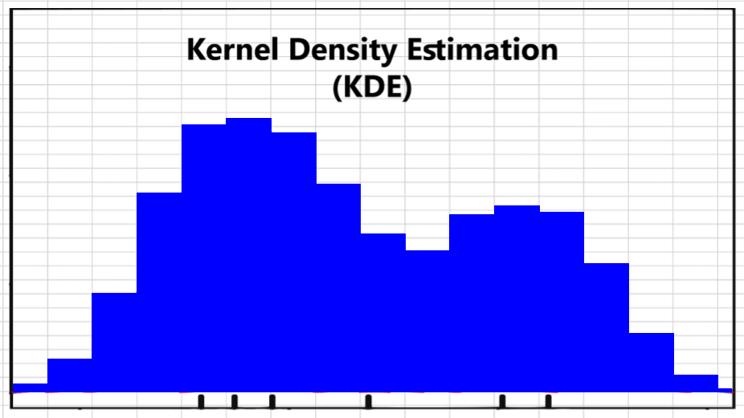

# KDE - method
## Installations

### Using a virtual environment
In order to setup the environment, first create a virtual environement from the root of the project:
```
python -m venv .venv && source .venv/bin/activate
```
Then, in order to install the differente libraries, two requirements.txt files are at disposal depending on the version of CUDA that you are using. Whether you are on windows or linux, you can find the version of CUDA you are using with the command:
```
nvcc --version
```
Then, you can follow one of the following cases:
- if you have a version newer or equal to CUDA 11.8, you can try and directly install all the libraries by running the following:
```
pip install -r requirements_cuda12.txt
```
- if you have an older version or if for some reasons the first requirement file doesn't work, you can install the addequate version of [pytorch](#https://pytorch.org/) and install the rest of the libraries by runnign the following:
```
pip install -r requirement_wo_torch.txt
```

### Using a docker container
This project was mainly used with docker. To use docker, use the followings : 
1. Mount the external drive: 
```sudo mount /media/...```
2. Restart the docker engine: ```sudo systemctl restart docker```
3. List all the docker's image on the wokstation: ```docker image list```
4. Use the **pdm** image
5. To create a new container using the image previously selected run: ```sudo docker run --gpus all --shm-size=8g -d -v ./:/workspace  --name my_container -it pdm:latest bash```
6. Verify the container is runing: ```sudo docker ps```
7. Launch the container : ```docker start my_container```

All details about the commands above can be find on the official [Docker's webpage](https://docs.docker.com/)


**_Additional note_**:

if, during the inference, all samples are marked as failed, it might be due to an incompatible version of numpy with the one of pytorch installed. This issue can be solved by downgrading the version of numpy to the following: `pip install numpy==1.26.4`


## Introduction
The concept of this model is based on Kernel Density Estimator. Each sample is mapped to a 3D normalized grid. This grid is then filtered through a process where a 3D kernel is matched to each point and discretized over a fixed number of neighbour cells. For each position in the grid, the values of all the kernels that overlap on it are then added up.

 Continue         		   |  Discrete
:-------------------------:|:-------------------------:
  |  

## Architecture
The architecture of this method is as following:
- data : this folder needs to be created since it is in the _.gitignore_ file. The dataset for the training can then be placed into it and will need to be referenced in the corresponding files.
- inference: This folder contains everything linked with inference (dataset, results)
- log: This folder contains all the results of the different trainings and grid-searchs. For each new one, a subfolder is created containing all the results. (logs, confusion matrix, best model, ...)
- src: This folder contains the different files for preprocessing, results visualization, dataset class, etc
- models: This folder contains the model implementation and a subfolder in which a _.tar_ file can be placed to train from existing model or for inference.
- _train.py_, _inference.py_ are the script to run for the corresponding tasks

## Dataset
Each dataset needs to be paced in the root of the folder _./data/_. 
The dataset structure should be as follows:
- dataset_name/ 
	- Single/
		- _*.pcd_
	- Multi/
		- _*.pcd_
	- Garbage/
		- _*.pcd_
	- modeltrees_shape_names.txt (name of the classes)

**Important note: The file modeltrees_shape_names.txt needs to be at the root of each dataset. It can be found in _./inference/_**

A helper script, _datasets_splitting.py_, can be used to automatically create the required folder structure and copy the files accordingly.
The pipeline is as follows:
1. Annotate the samples.
2. Update the labels at the begining of the file if they differ from _Single_, _Multi_ or _Garbage_.
3. Run:
```python3 datasets_splitting.py path/to/data/directory path/to/labels/file path/to/destination```

## Training
The training pipeline is orchestrated through the _train.py_ script, which initializes the model, loads the training dataset, and manages the optimization loop. All training configurations (e.g., learning rate, number of epochs, architectural parameters) are defined in the _config.yaml_ file.

If the dataset is new, the flag _do_preprocess_ needs to be _True_. It will trigger the creation of the _.csv_ files and the list of classes inside the folder of the dataset. 

To add an additional class (for example, a _Part_of_tree_ class), update the _num_class_ parameter accordingly. You may also adjust the number of synthetic samples by modifying the _n_augmentations_ parameter.

## Inference
For inference, data augmentation is disabled. All hyperparameters are defined in the same config.yaml file to ensure consistency with the training setup. 
The overall data processing flow remains similar to the training pipeline to ensure consistency. Once the data are placed in the ./inference/ directory and indexed via a CSV file (automatically created during the first run if do_preprocess is set to _True_), the inference pipeline calls _pcd_to_pickle.py_ to convert all point cloud samples into serialized_.pickle_ files in a single pass.
At the end of the inference time, a file _results.csv_ will be created containing the class assignation per sample. 